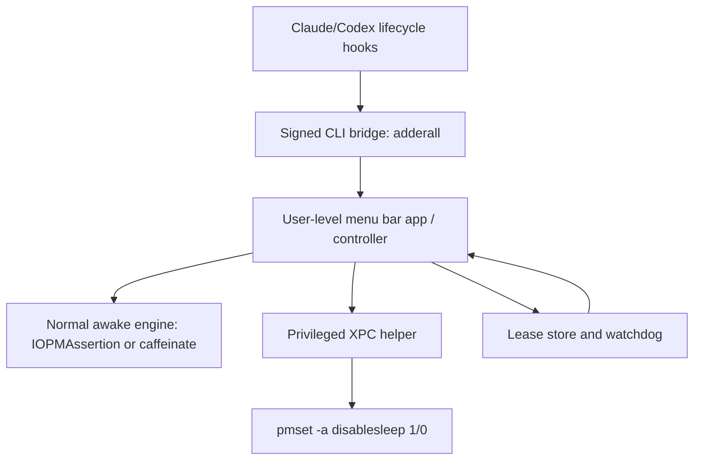

# Adderall

Adderall is a working codename for a macOS menu bar app that keeps a Mac awake only while a local AI coding agent is actively working.

The initial target is developers who close their MacBook while Claude Code, Codex, or a similar local coding agent is still running. Generic keep-awake apps solve part of this, but they usually stay active because the app or a timer is active. Adderall should instead stay active because an agent session is active.

The core product promise:

> Let coding agents keep running with the lid closed, then restore normal sleep behavior automatically when the agent stops.

The name is intentionally treated as a codename. Before public launch, revisit naming because "Adderall" is a prescription drug brand and may be risky from a legal, App Store, search, and trust perspective.

## Scope

### Primary goal

Build a polished macOS app that installs agent lifecycle hooks and uses those hooks to create a temporary wake lease while an agent is actually running.

The app should support two levels of sleep prevention:

1. Normal agent-awake mode
   - Works without admin permission.
   - Uses `IOPMAssertion` or `/usr/bin/caffeinate`.
   - Prevents normal idle sleep while the lid is open.
   - Releases automatically when the agent finishes or the lease expires.

2. Closed-lid mode
   - Requires one-time admin approval during setup.
   - Installs a narrow privileged helper daemon.
   - Uses `/usr/bin/pmset -a disablesleep 1` while at least one agent lease is active.
   - Restores `/usr/bin/pmset -a disablesleep 0` when all leases end, unless the user already had sleep disabled before Adderall touched it.
   - Must include crash recovery, stale state cleanup, and a heartbeat timeout.

### First supported agents

Start with:

- Claude Code, because hooks are documented and mature enough for lifecycle-driven behavior.
- Codex, because hooks are emerging and relevant to the same user base.

Later targets:

- Aider
- Goose
- OpenCode
- Cursor agent terminals, if there is a reliable lifecycle signal
- Generic process-based mode as a fallback, but not as the core differentiator

### Non-goals

Adderall should not be a generic clone of Amphetamine.

Out of scope for the first version:

- Keeping the Mac awake whenever an app is open, regardless of agent activity.
- Replacing all of Amphetamine's triggers, timers, AppleScript commands, and power-user controls.
- Running hidden privileged behavior without explicit user approval.
- Calling `sudo` from hooks.
- Exposing arbitrary command execution from the privileged helper.
- Cloud accounts, telemetry, or remote control.
- Windows or Linux support.

## Product Model

The product should feel like a simple menu bar utility, but internally it is a lease manager.

A lease is a short-lived claim that says:

> This agent session is still working. Keep the machine awake until this lease ends or expires.

The app should support multiple simultaneous leases. If Claude and Codex are both running, Adderall should only restore normal sleep after both have stopped or expired.

Example lifecycle:

1. User submits a Claude Code prompt.
2. Claude hook calls `adderall begin --provider claude --session <id>`.
3. Adderall creates or refreshes an active lease.
4. If closed-lid mode is enabled, the privileged helper toggles `pmset disablesleep` on.
5. Claude hook sends heartbeats while work continues.
6. Claude stop/session-end hook calls `adderall end --provider claude --session <id>`.
7. If no leases remain, Adderall restores normal sleep behavior.
8. If the end hook never fires, the lease expires after a TTL and cleanup runs anyway.

## Architecture



### Components

#### 1. Menu bar app

The user-facing app.

Responsibilities:

- Onboarding and setup.
- Install, repair, and uninstall Claude/Codex hooks.
- Show current state: inactive, active agent lease, closed-lid mode active, helper missing, stale state restored.
- Configure TTL, supported agents, and closed-lid mode.
- Hold normal `IOPMAssertion` leases when closed-lid mode is not required.
- Talk to the privileged helper when closed-lid mode is enabled.

#### 2. Hook CLI bridge

A tiny executable invoked by Claude/Codex hooks.

Example commands:

```sh
adderall begin --provider claude --session "$SESSION_ID"
adderall heartbeat --provider claude --session "$SESSION_ID"
adderall end --provider claude --session "$SESSION_ID"
adderall status --json
```

Rules:

- Must be fast.
- Must be non-interactive.
- Must never call `sudo`.
- Must return predictable exit codes.
- Should tolerate the menu bar app not being open by connecting to a user-level controller or starting the app if needed.

#### 3. User-level controller

This can initially live inside the menu bar app. If reliability requires it, split it into a user `LaunchAgent`.

Responsibilities:

- Track active leases.
- Deduplicate sessions.
- Apply TTL expiry.
- Hold normal power assertions.
- Decide when to request closed-lid mode from the helper.

#### 4. Privileged helper daemon

This is required for the polished closed-lid product.

The helper should be installed once during onboarding through Apple's ServiceManagement APIs. After approval, runtime toggles should not require repeated admin prompts.

Responsibilities:

- Run as a root `LaunchDaemon`.
- Listen for XPC requests on a named Mach service.
- Validate that the caller is signed by the expected app/team.
- Expose only a tiny API.
- Toggle `pmset` only through lease-aware commands.
- Restore stale state on startup.
- Exit or stay idle when no work is active.

Proposed helper API:

```swift
beginClosedLidLease(provider: String, sessionID: String, ttlSeconds: Int)
heartbeatClosedLidLease(sessionID: String, ttlSeconds: Int)
endClosedLidLease(sessionID: String)
status()
restore()
```

Security rule: the helper must not expose a generic "run command" API.

#### 5. State and recovery

Closed-lid mode changes a persistent system setting. Treat that as dangerous state.

Minimum recovery behavior:

- Before changing `SleepDisabled`, read and store the previous state.
- Write an ownership marker under `/Library/Application Support/Adderall/`.
- Only restore a setting that Adderall changed.
- On helper startup, if a marker exists but no active lease exists, restore.
- On uninstall, restore.
- On TTL expiry, restore.
- On app crash or XPC disconnect, restore if no leases remain.

## Why A Daemon Is Needed

`caffeinate` and `IOPMAssertion` are enough for normal idle sleep prevention and do not require admin permission.

Closed-lid behavior is different. Preventing sleep while a MacBook lid is closed generally requires changing a system-level power setting with `pmset`, such as:

```sh
pmset -a disablesleep 1
```

Changing `pmset` settings requires root. Hooks cannot safely run `sudo` because hooks are non-interactive and may hang or fail on password prompts. The polished macOS pattern is:

1. Ask for admin approval once during setup.
2. Install a privileged helper daemon.
3. Have hooks call a normal signed CLI.
4. Have the CLI/app talk to the helper through XPC.
5. Let the helper perform the narrow root-only operation.

## Inspiration

### Modafinil

Modafinil is the closest technical reference. It is a macOS menu bar app that prevents a MacBook from sleeping when the lid is closed while letting the display turn off.

Things to learn from Modafinil:

- It uses a privileged helper registered with `SMAppService.daemon`.
- It exposes a small XPC protocol from the helper to the app.
- It validates the client's code signature before accepting XPC connections.
- It writes an ownership marker under `/Library/Application Support/Modafinil/`.
- It restores stale sleep-prevention state on helper startup.
- It uses `pmset -a disablesleep 1/0` for closed-lid behavior.
- It monitors clamshell/lid state and turns the display off when appropriate.

Where Adderall should differ:

- Modafinil is primarily manual: user toggles it.
- Adderall should be agent-aware: hooks create leases only while agent work is active.
- Adderall should handle multiple concurrent sessions.
- Adderall should make TTL and stale cleanup central to the product, not just defensive cleanup.

### Amphetamine

Amphetamine is the mature user-facing reference for a polished Mac keep-awake utility.

Things to learn from Amphetamine:

- Clear menu bar status.
- Explicit sessions.
- Trigger-based automation.
- Strong user trust around restoring normal sleep behavior.
- Closed-display mode UX and warnings.

Where Adderall should differ:

- Amphetamine is broad and trigger-heavy.
- Adderall should be focused on agent lifecycle.
- The setup should feel like "install hooks once, then it works automatically."

### Agent hooks

Claude Code and Codex hooks are the core wedge. Hooks let the app observe actual agent lifecycle events instead of guessing from process names.

The key product insight:

> A coding agent being installed or open is not the same thing as a coding agent actively working.

Adderall should use hooks to distinguish those states.

## MVP Plan

### MVP 0: Research prototype

Goal: prove closed-lid toggling and hook lifecycle behavior.

Deliverables:

- Swift menu bar app.
- Local CLI bridge.
- Claude Code hook installer.
- Privileged helper using XPC.
- `pmset disablesleep` toggle behind helper API.
- Lease TTL and stale recovery.
- Manual uninstall that restores state.

Success criteria:

- Closing the lid during an active lease does not stop the agent.
- Stopping the agent restores normal sleep behavior.
- Killing the app or helper does not leave the Mac permanently sleep-disabled.
- No hook command ever prompts for a password.

### MVP 1: Private alpha

Goal: make the product safe enough for daily use.

Deliverables:

- Claude Code support.
- Codex support if the local hook format is stable enough.
- Menu bar status and diagnostics.
- Repair hooks.
- Uninstall hooks.
- Helper approval state detection.
- Logs bundle for debugging.
- Notarized Developer ID distribution.

Success criteria:

- Users can install once and forget it.
- Users can see why the Mac is being kept awake.
- Users can remove everything cleanly.
- Closed-lid mode survives common failures: app quit, hook failure, helper restart, machine reboot.

### MVP 2: Polished public app

Goal: ship as a trusted utility.

Deliverables:

- Onboarding flow with plain-language permission explanation.
- Agent integrations page.
- Closed-lid mode warning and battery/thermal guidance.
- Auto-update.
- Signed and notarized releases.
- Separate App Store feasibility analysis.

Success criteria:

- The app can be recommended without asking users to run terminal commands.
- Support burden is low because failure states are visible and recoverable.
- The product is differentiated from Amphetamine by agent-aware automation.

## Distribution Strategy

Start with a Developer ID notarized app, not the Mac App Store.

Reason:

- Closed-lid mode needs privileged behavior.
- The helper changes system power settings.
- App Store review may reject or constrain this behavior.
- A Developer ID app gives more room to validate the product honestly.

Later, consider a Mac App Store version with reduced scope:

- Normal agent-awake mode only.
- No privileged closed-lid mode, unless App Review accepts the helper model.
- Clear upgrade path to the notarized version if closed-lid mode is required.

## UX Principles

- The user should always know why the Mac is awake.
- Setup should be explicit, but runtime should be automatic.
- Admin approval should happen once, during setup, not during agent execution.
- The app should prefer restoring normal sleep over staying awake forever.
- Closed-lid mode should have visible battery and heat warnings.
- The app should never hide privileged behavior behind vague language.

## Open Questions

- Which Claude hook events provide the most reliable lifecycle signal for long-running tasks?
- How stable is Codex hook support across installed versions?
- Should the CLI talk directly to the privileged helper, or should it always go through the user-level controller?
- How should session IDs be derived when an agent does not expose a stable ID?
- What is the safest default TTL?
- Should closed-lid mode be opt-in per provider or global?
- Should the product name remain drug-themed, or should this repo stay a codename only?

## Resources To Read Before Starting

### Reference apps

- Modafinil repo: https://github.com/narcotic-sh/modafinil
- Modafinil helper implementation: https://github.com/narcotic-sh/modafinil/blob/main/Sources/ModafinilHelper/HelperService.swift
- Modafinil XPC client: https://github.com/narcotic-sh/modafinil/blob/main/Sources/Modafinil/PrivilegedHelperClient.swift
- Modafinil helper installer: https://github.com/narcotic-sh/modafinil/blob/main/Sources/Modafinil/PrivilegedHelperInstaller.swift
- Modafinil client signature validation: https://github.com/narcotic-sh/modafinil/blob/main/Sources/ModafinilHelper/ClientValidator.swift
- Modafinil launchd plist: https://github.com/narcotic-sh/modafinil/blob/main/Packaging/com.narcotic.modafinil.helper.plist
- Modafinil lid monitor: https://github.com/narcotic-sh/modafinil/blob/main/Sources/Modafinil/LidMonitor.swift
- Amphetamine App Store listing: https://apps.apple.com/us/app/amphetamine/id937984704

### macOS background services

- Apple: Creating Launch Daemons and Agents: https://developer.apple.com/library/archive/documentation/MacOSX/Conceptual/BPSystemStartup/Chapters/CreatingLaunchdJobs.html
- Apple: The Life Cycle of a Daemon: https://developer.apple.com/library/archive/documentation/MacOSX/Conceptual/BPSystemStartup/Chapters/Lifecycle.html
- Apple: Designing Daemons and Services: https://developer.apple.com/library/archive/documentation/MacOSX/Conceptual/BPSystemStartup/Chapters/DesigningDaemons.html
- Apple: `SMAppService`: https://developer.apple.com/documentation/servicemanagement/smappservice
- Apple: XPC: https://developer.apple.com/documentation/foundation/xpc

### macOS power management

- Apple: Technical Q&A QA1340, Registering and unregistering for sleep and wake notifications: https://developer.apple.com/library/archive/qa/qa1340/_index.html
- Apple: `IOPMAssertionCreateWithDescription`: https://developer.apple.com/documentation/iokit/1557078-iopmassertioncreatewithdescripti
- Local man page to read: `man caffeinate`
- Local man page to read: `man pmset`
- Local diagnostic commands:

```sh
pmset -g
pmset -g assertions
pmset -g log
```

### Agent hooks

- Claude Code hooks reference: https://code.claude.com/docs/en/hooks
- Claude blog on configuring hooks: https://claude.com/blog/how-to-configure-hooks
- OpenAI Codex repo: https://github.com/openai/codex
- Codex hooks discussions and issues: https://github.com/openai/codex/issues?q=hooks

### Security and distribution

- Apple App Review Guidelines: https://developer.apple.com/app-store/review/guidelines/
- Apple notarization overview: https://developer.apple.com/documentation/security/notarizing-macos-software-before-distribution
- Apple code signing guide: https://developer.apple.com/documentation/security/code-signing-services

## Initial Implementation Bias

Use native Swift and AppKit for the first build.

Why:

- The app is deeply macOS-specific.
- The hard parts are ServiceManagement, XPC, launchd, IOKit, code signing, and power management.
- Adding Electron or a web stack would increase packaging complexity without reducing the OS risk.

Recommended initial package shape:

```text
Adderall/
  Package.swift
  Sources/
    AdderallApp/
    AdderallCLI/
    AdderallHelper/
    AdderallShared/
  Packaging/
    com.example.adderall.helper.plist
  README.md
```

The first code should be boring and narrow. The hard requirement is not visual polish. The hard requirement is that the app never leaves a user's Mac in a surprising power state.
