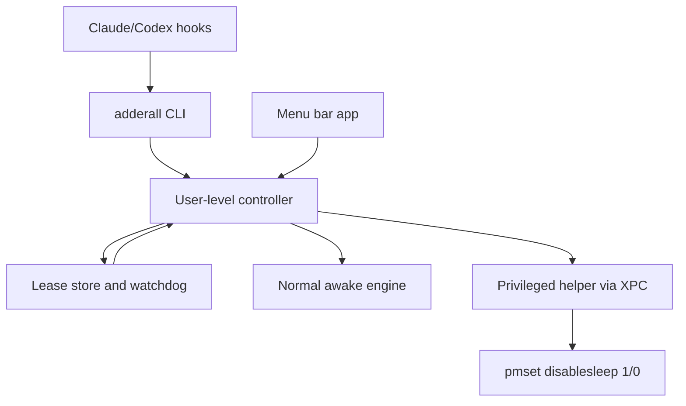

# Adderall

Adderall is a working codename for a macOS utility that keeps a Mac awake only while a local AI coding agent is actively working.

The product promise:

> Let coding agents keep running, including during closed-lid workflows when explicitly enabled, then restore normal sleep behavior automatically when the agent stops.

The name is a codename. Before public release, revisit it because "Adderall" is a prescription drug brand and may create legal, App Store, search, and trust issues.

## Current Direction

This project should start as a proof of concept, not a polished app.

The first thing to prove is not the menu bar UI. The first thing to prove is that an agent lifecycle event can create a short-lived lease, keep the Mac awake while that lease is active, and reliably restore normal sleep behavior when the lease ends or expires.

Adderall should be installed as deterministic lifecycle hooks, not exposed as a model-chosen tool. A tool is something the agent may decide to call. A hook is something the agent runtime invokes because an event happened. Keeping the Mac awake must not depend on the model remembering to call a tool.

## MVP

### MVP 0: lease lifecycle proof

Goal: prove the core agent-aware behavior without privileged macOS complexity.

Deliverables:

- Swift command-line tool named `adderall`.
- Commands:
  - `adderall begin --provider claude --session <id>`
  - `adderall heartbeat --provider claude --session <id>`
  - `adderall end --provider claude --session <id>`
  - `adderall status --json`
- Local lease store.
- TTL expiry for stale leases.
- Manual test flow that simulates Claude or Codex hooks.
- Normal idle-sleep prevention through `IOPMAssertion` or `/usr/bin/caffeinate`.
- Hook event mapping documented for Claude Code and Codex.

Success criteria:

- A lease can be started from the CLI.
- A heartbeat refreshes the lease TTL.
- Ending the lease restores normal behavior.
- Expired leases are cleaned up automatically.
- No command requires `sudo`.
- No command prompts for a password during normal agent execution.
- The lease protocol works even when heartbeat is manually simulated.

Important constraint: neither Claude Code nor Codex should be treated as having a guaranteed native periodic heartbeat event. Adderall's `heartbeat` command is our lease-refresh protocol. Provider hooks can invoke it when useful lifecycle events occur.

### MVP 1: persistent user controller

Goal: move from short-lived CLI behavior to a persistent user-level process.

Deliverables:

- Minimal macOS app or user-level controller.
- Shared lease manager used by both the CLI and app/controller.
- App/controller holds normal awake assertions while leases are active.
- CLI talks to the controller instead of trying to be the long-running process.

Success criteria:

- The CLI can exit quickly after sending a lifecycle event.
- The user-level controller remains responsible for active lease state.
- Normal idle-sleep prevention survives beyond the lifetime of the CLI process.

### MVP 2: closed-lid helper proof

Goal: add the dangerous part only after lease behavior is already proven.

Deliverables:

- Privileged helper daemon installed through Apple's ServiceManagement APIs.
- Tiny XPC API between the user-level controller and helper.
- Helper toggles `/usr/bin/pmset -a disablesleep 1` only while closed-lid leases are active.
- Helper restores `/usr/bin/pmset -a disablesleep 0` when Adderall-owned leases end, expire, or recover from stale state.
- Ownership marker under `/Library/Application Support/Adderall/`.

Success criteria:

- First-time setup can request admin approval intentionally.
- Runtime hook commands never request admin approval.
- No hook calls `sudo`.
- Killing the app/helper does not leave the Mac permanently sleep-disabled.
- The helper exposes no generic command execution API.

### MVP 3: agent hook integration

Goal: bind proven CLI behavior to real agent lifecycle hooks.

Deliverables:

- Claude Code hook installer.
- Codex hook installer if the local hook format is stable enough.
- Hook repair and uninstall commands.
- Hook diagnostics.

Success criteria:

- Hooks invoke `adderall begin`, `heartbeat`, and `end`.
- Hook commands are fast and non-interactive.
- If the helper is not installed, hooks fail clearly or fall back to normal awake mode.
- The integration does not rely on the model choosing to call an Adderall tool.

Preferred hook mapping:

```text
UserPromptSubmit -> adderall begin
PreToolUse       -> adderall heartbeat
PostToolUse      -> adderall heartbeat
Stop             -> adderall end or shorten TTL when background work may remain
SessionEnd       -> adderall cleanup-session, when available
```

Provider hooks are hints. Lease TTL cleanup is the safety net.

### MVP 4: menu bar UI

Goal: provide a minimal but trustworthy user surface.

Deliverables:

- Menu bar status: inactive, active lease, helper missing, closed-lid mode active, stale state restored.
- Setup controls for helper approval and hook installation.
- Uninstall and restore controls.
- Diagnostics view.

Success criteria:

- The user can see why the Mac is awake.
- The user can remove hooks and restore power state.
- Runtime remains automatic after setup.

## Architecture



### Mental model

This is closer to a small local operating-system utility than a web app.

The repository may look like a monorepo, but the runtime model is different:

- Xcode or Swift Package Manager organizes code into targets.
- Targets build products.
- Some products are runnable executables.
- Each executable has its own process, code signature, entitlements, and privilege level.
- Shared code is compiled into other products; it does not run by itself.

`xcodebuild` builds the products. It does not run every product together in parallel.

At runtime:

- The CLI runs only when a hook or user invokes it.
- The menu bar app or user controller is the persistent user-level process.
- The privileged helper runs as a root LaunchDaemon when registered and started by macOS.
- XPC is the RPC-like boundary between normal user code and the privileged helper.

## Hook Integration Model

Adderall should install hook configuration for supported agents.

The hook configuration invokes the `adderall` CLI automatically on lifecycle events. The agent model should not need to know Adderall exists.

Avoid this:

```text
agent model decides to call an Adderall tool
```

Prefer this:

```text
agent runtime event -> installed hook -> adderall CLI -> user-level controller
```

### Claude Code

Claude Code has mature lifecycle hooks. The useful events for Adderall are:

- `UserPromptSubmit`: begin or refresh a turn lease.
- `PreToolUse`: heartbeat before a potentially long tool call.
- `PostToolUse`: heartbeat after a tool call.
- `Stop`: end the turn lease, unless background task metadata indicates work may still be active.
- `SessionEnd`: cleanup all leases for the session, when available.

`PostToolUse` is not a true periodic heartbeat. If one tool call runs for a long time, no post-tool event arrives until it finishes. `PreToolUse` helps by refreshing before the long operation begins, and TTL expiry remains the fallback.

### Codex

Codex hooks are relevant but should be treated as less mature for the first implementation.

The useful events are:

- `UserPromptSubmit`: begin or refresh a turn lease.
- `PreToolUse`: heartbeat before a tool call.
- `PostToolUse`: heartbeat after a tool call.
- `Stop`: end or shorten the lease.
- `SessionStart`: setup/status only, not active-work begin.

Do not treat "Codex session exists" as "Codex is actively working." Use turn and tool events for active leases.

Codex support may need workarounds because hook behavior is still evolving. Known risks to design around:

- hook configuration edits may require a session restart;
- stop hooks may not fire for every abnormal stop path;
- session-start behavior may differ between cold start, resume, and soft restart.

## Components

### CLI bridge

The CLI is the external integration surface for agents.

Rules:

- Fast.
- Non-interactive.
- Predictable exit codes.
- Never calls `sudo`.
- Never prompts for a password during `begin`, `heartbeat`, or `end`.
- Talks to the user-level controller when available.

The CLI is not the main internal API for the app. The menu bar app and CLI should share lower-level code or communicate with the same controller.

The CLI is also the hook target. It should be safe for hooks to call repeatedly:

```text
adderall begin
adderall heartbeat
adderall heartbeat
adderall end
```

Repeated `begin` and `heartbeat` calls should be idempotent for the same provider/session pair.

### User-level controller

The controller is the product brain.

Responsibilities:

- Track active leases.
- Deduplicate sessions.
- Apply TTL expiry.
- Hold normal power assertions.
- Decide whether closed-lid mode should be active.
- Request privileged helper actions through XPC when needed.

This can initially live inside the menu bar app. If reliability requires it, split it into a user `LaunchAgent`.

### Normal awake engine

Normal awake mode should work without admin approval.

Candidate implementations:

- `IOPMAssertion`
- `/usr/bin/caffeinate`

This prevents normal idle sleep, especially while the lid is open. It is not the complete closed-lid solution.

### Privileged helper

The helper is only for root-required closed-lid behavior.

Responsibilities:

- Run as a root LaunchDaemon.
- Listen for XPC requests.
- Validate that callers are signed by the expected app/team.
- Expose a tiny API.
- Toggle `pmset` only through lease-aware methods.
- Restore stale Adderall-owned state on startup or uninstall.

The helper must not expose a generic "run command" API.

Proposed helper API:

```swift
beginClosedLidLease(provider: String, sessionID: String, ttlSeconds: Int)
heartbeatClosedLidLease(sessionID: String, ttlSeconds: Int)
endClosedLidLease(sessionID: String)
status()
restore()
```

## Why Not `sudo`

`sudo` runs a command with elevated privileges, usually as `root`.

That is acceptable for deliberate manual testing, but it is not acceptable in agent hooks or runtime product behavior.

Reasons:

- Hooks must be non-interactive.
- `sudo` may request a password and hang.
- Runtime password prompts are surprising and unreliable.
- `sudo` gives broad command-level privilege instead of a narrow helper API.
- A signed helper lets the product ask for admin approval once during setup, then perform only the specific privileged operation it was designed for.

Preferred flow:

```text
agent hook -> normal CLI -> user-level controller -> signed privileged helper -> pmset
```

Avoid:

```text
agent hook -> sudo pmset
```

## AppKit and SwiftUI

AppKit and SwiftUI are both native Apple UI frameworks.

AppKit is the older, mature macOS UI framework. It is imperative and object-oriented. It gives direct access to macOS UI primitives such as windows, menus, status bar items, views, controls, delegates, and event handling.

SwiftUI is newer and declarative. It is closer to React than to Tailwind. You describe UI as a function of state, and SwiftUI updates the rendered UI when state changes.

For this project:

- SwiftUI is likely enough for the first menu bar UI through `MenuBarExtra`.
- AppKit may still be needed for lower-level macOS utility behavior.
- The two can coexist through hosting APIs.

## Recommended Project Shape

```text
Adderall/
  Package.swift
  Sources/
    AdderallApp/
    AdderallCLI/
    AdderallHelper/
    AdderallShared/
  Packaging/
    com.example.adderall.helper.plist
  memories/
  AGENTS.md
  README.md
```

Expected targets:

- `AdderallApp`: menu bar app or initial user-level controller.
- `AdderallCLI`: command-line bridge called by hooks.
- `AdderallHelper`: privileged helper daemon.
- `AdderallShared`: shared lease models, command parsing, and protocol definitions.

## Things To Learn First

Read enough to understand the surface area before implementation:

- Xcode targets, products, schemes, build settings, signing.
- Swift Package Manager and `Package.swift`.
- Swift basics for CLI and macOS app code.
- SwiftUI `MenuBarExtra`.
- AppKit status bar and menu concepts.
- `IOPMAssertion` and `/usr/bin/caffeinate`.
- `pmset`, especially `pmset -g`, `pmset -g assertions`, and `pmset -g log`.
- ServiceManagement and `SMAppService`.
- `launchd`, LaunchAgents, and LaunchDaemons.
- XPC and `NSXPCConnection`.
- Code signing, hardened runtime, and notarization.

## Safety Rules

The hard requirement is not visual polish. The hard requirement is that the app never leaves a user's Mac in a surprising power state.

Rules:

- Treat hooks as best-effort signals, not the source of truth.
- Prefer restoring normal sleep over staying awake forever.
- Use TTLs for every lease.
- Treat closed-lid mode as dangerous state.
- Store the previous system sleep-disabled state before changing it.
- Restore only settings Adderall changed.
- Keep an ownership marker for privileged state.
- Restore on TTL expiry, helper startup, uninstall, app crash recovery, and stale marker detection.
- Never run arbitrary shell commands from the helper.
- Never call `sudo` from hooks.
- Do not rely on model-chosen tool calls for power-state behavior.
- Surface failures loudly.

## Reference Material

Reference apps:

- Modafinil: https://github.com/narcotic-sh/modafinil
- Amphetamine: https://apps.apple.com/us/app/amphetamine/id937984704

Apple docs:

- Swift packages: https://developer.apple.com/documentation/xcode/swift-packages
- SwiftUI `MenuBarExtra`: https://developer.apple.com/documentation/swiftui/menubarextra
- AppKit: https://developer.apple.com/documentation/appkit
- ServiceManagement `SMAppService`: https://developer.apple.com/documentation/servicemanagement/smappservice
- XPC: https://developer.apple.com/documentation/foundation/xpc
- `NSXPCConnection`: https://developer.apple.com/documentation/foundation/nsxpcconnection
- `IOPMAssertionCreateWithDescription`: https://developer.apple.com/documentation/iokit/1557078-iopmassertioncreatewithdescripti

Local docs:

```sh
man caffeinate
man pmset
```
