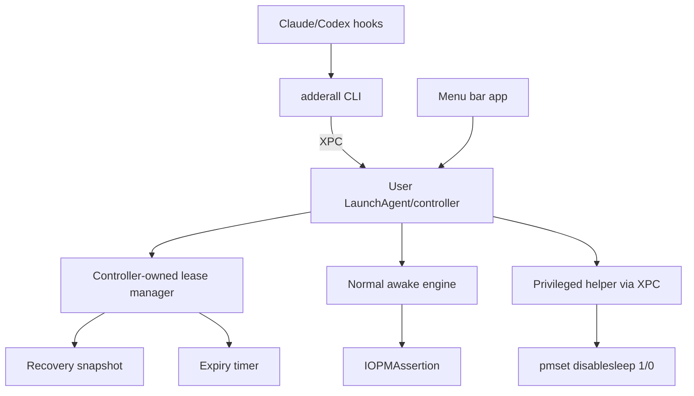

# Adderall

Adderall is a working codename for a macOS utility that keeps a Mac awake only while a local AI coding agent is actively working.

The product promise:

> Let coding agents keep running, including during closed-lid workflows when explicitly enabled, then restore normal sleep behavior automatically when the agent stops.

The name is a codename. Before public release, revisit it because "Adderall" is a prescription drug brand and may create legal, App Store, search, and trust issues.

Naming convention:

- `Adderall` is the project, app, package, and Swift target naming style.
- `adderall` is the lowercase command-line executable that hooks invoke.

## Current Direction

This project should start as a proof of concept, not a polished app.

The first thing to prove is not the menu bar UI. The first thing to prove is that an agent lifecycle event can reach a persistent user-level controller, create or refresh a short-lived lease, keep the Mac awake while that lease is active, and reliably restore normal sleep behavior when the lease ends or expires.

The standalone `caffeinate`-managed CLI is not a goal. It is too trivial and does not match the intended runtime model. The lease protocol from the original MVP 0 remains important, but it should be implemented through a controller-first architecture:

```text
agent hook -> adderall CLI -> XPC -> user-level controller -> IOPMAssertion
```

Adderall should be installed as deterministic lifecycle hooks, not exposed as a model-chosen tool. A tool is something the agent may decide to call. A hook is something the agent runtime invokes because an event happened. Keeping the Mac awake must not depend on the model remembering to call a tool.

The CLI should not be the source of truth for power state, and the lease store should not be used as a command bus. The controller owns lease state. The store is only for recovery, diagnostics, and status snapshots.

No polling loop should be used to discover lease changes. CLI commands should notify the controller directly over IPC. Timers are still appropriate for scheduling the next lease expiry.

## Development Workflow

Start with Swift Package Manager unless Xcode becomes useful for a specific Apple-platform task.

For the controller-first proof, SwiftPM is enough for the core code:

```text
Package.swift
Sources/
  AdderallCLI/
  AdderallController/
  AdderallShared/
```

The controller executable uses `swift-service-lifecycle` only for process lifecycle scaffolding: start the XPC listener, wait for graceful shutdown signals, and invalidate the listener on exit. Lease state, snapshots, and power assertions remain explicit controller-owned logic.

The full Xcode toolchain should remain installed because later work needs Apple signing, entitlements, app bundles, `SMAppService`, XPC, helper daemons, and notarization. The Xcode editor UI is optional for early work.

A future Xcode project or workspace should wrap or consume the same local package code. It should not require porting the implementation into a separate codebase.

Recommended editor/build posture:

- Use Zed or another editor for most code editing.
- Use `swift build` and `swift test` for shared logic and CLI/controller iteration.
- Use `.build/debug/adderall install claude` to copy the current CLI/controller binaries into user application support storage, bootstrap the user LaunchAgent, and install Claude Code hooks.
- Use `.build/debug/adderall uninstall claude` to remove Claude Code hooks and stop/remove the user LaunchAgent.
- Use `adderall status --json` and simulated `adderall hook claude` stdin payloads to verify XPC, lease, snapshot, expiry, and normal-awake behavior.
- Add `xcodebuild` and Xcode project metadata when app bundles, LaunchAgent registration through `SMAppService`, privileged helpers, signing, or notarization require it.
- Open Xcode when it materially simplifies signing, capabilities, bundle embedding, or preview/debug workflows.

## MVP Roadmap

### MVP 1: controller-first normal-awake proof

Goal: prove the real local runtime shape without privileged closed-lid behavior.

Deliverables:

- Swift command-line tool named `adderall`.
- Persistent user-level controller executable named `adderall-controller`.
- Shared lease/status models in `AdderallShared`, with live lease management owned by `AdderallController`.
- Controller XPC interface.
- LaunchAgent plist for the controller with a Mach service name.
- Commands:
  - `adderall begin --provider claude --session <id>`
  - `adderall heartbeat --provider claude --session <id>`
  - `adderall end --provider claude --session <id>`
  - `adderall status --json`
- Controller-owned lease state.
- Recovery snapshot under user-owned application support storage.
- TTL expiry using scheduled timers, not polling.
- Normal idle-sleep prevention through `IOPMAssertion`.
- Manual test flow that simulates Claude or Codex hooks.
- Hook event mapping documented for Claude Code and Codex.

Success criteria:

- The controller can run as a user-level process.
- The CLI sends lifecycle events to the controller over XPC and exits quickly.
- A lease can be started from the CLI.
- A heartbeat refreshes the lease TTL.
- Repeated `begin` and `heartbeat` calls are idempotent for the same provider/session pair.
- Ending the lease restores normal sleep behavior when no active leases remain.
- Expired leases are cleaned up by the controller automatically.
- The controller holds a normal awake assertion while at least one lease is active.
- The controller releases the awake assertion when the last lease ends or expires.
- `adderall status --json` reports controller state and active leases.
- Controller restart drops expired leases and avoids restoring stale awake state indefinitely.
- No command requires `sudo`.
- No command prompts for a password during normal agent execution.
- If the controller is unavailable, the CLI fails clearly and non-interactively.

Important constraints:

- Neither Claude Code nor Codex should be treated as having a guaranteed native periodic heartbeat event.
- Adderall's `heartbeat` command is the lease-refresh protocol.
- Provider hooks can invoke heartbeat when useful lifecycle events occur.
- The lease store is not IPC. The CLI must not mutate it directly.
- Shared lease/status types do not imply shared state ownership. The controller owns live lease mutation and expiry.
- Do not introduce closed-lid `pmset` behavior in this milestone.

### MVP 2: agent hook integration

Goal: bind the controller-backed CLI to real agent lifecycle hooks for normal awake mode.

Deliverables:

- Claude Code hook entrypoint through `adderall hook claude`.
- Claude Code hook installer through `adderall install claude`.
- Claude Code hook uninstaller through `adderall uninstall claude`.
- Codex hook installer if the local hook format is stable enough.
- Hook repair and diagnostics commands.
- Manual hook simulation documentation.

Success criteria:

- Claude Code hooks invoke `adderall hook claude`.
- `adderall hook claude` maps hook JSON to `begin`, `heartbeat`, and `end` requests over XPC.
- Hook commands are fast and non-interactive.
- Runtime hook failures fail open, are logged, and do not block Claude Code.
- Manual install/uninstall failures fail loudly.
- The integration does not rely on the model choosing to call an Adderall tool.
- Normal awake mode works through real agent activity while the lid is open.

Preferred hook mapping:

```text
UserPromptSubmit -> begin
PreToolUse       -> heartbeat, with tool timeout-aware TTL when available
PostToolBatch    -> heartbeat
PostToolUseFailure -> heartbeat
Stop             -> end or shorten TTL when background work may remain
StopFailure      -> end
SessionEnd       -> end
```

Provider hooks are hints. Lease TTL cleanup is the safety net.

### MVP 3: closed-lid helper proof

Goal: add the dangerous root-required part only after controller-backed lease behavior is already proven.

Deliverables:

- Privileged helper daemon installed through Apple's ServiceManagement APIs.
- Tiny XPC API between the user-level controller and helper.
- Helper toggles `/usr/bin/pmset -a disablesleep 1` only while closed-lid leases are active.
- Helper restores `/usr/bin/pmset -a disablesleep 0` when Adderall-owned leases end, expire, or recover from stale state.
- Ownership marker under `/Library/Application Support/Adderall/`.

Success criteria:

- First-time setup can request admin approval intentionally.
- Runtime hook commands never request admin approval.
- No hook calls `sudo`.
- Killing the app, controller, or helper does not leave the Mac permanently sleep-disabled.
- The helper exposes no generic command execution API.
- If the helper is not installed, hooks fail clearly or fall back to normal awake mode.

### MVP 4: menu bar UI and packaging

Goal: provide a minimal but trustworthy user surface and make setup manageable.

Deliverables:

- Minimal macOS menu bar app.
- Menu bar status: inactive, active lease, controller unavailable, helper missing, closed-lid mode active, stale state restored.
- Setup controls for LaunchAgent/controller registration, helper approval, and hook installation.
- Uninstall and restore controls.
- Diagnostics view.
- Packaging/signing path suitable for local installation first, public distribution later.

Success criteria:

- The user can see why the Mac is awake.
- The user can remove hooks and restore power state.
- Runtime remains automatic after setup.
- The app/controller/helper relationship is understandable and debuggable.

## Architecture



### Mental model

This is closer to a small local operating-system utility than a web app.

The repository may look like a monorepo, but the runtime model is different:

- Swift Package Manager or Xcode organizes code into targets.
- Targets build products.
- Some products are runnable executables.
- Each executable has its own process, code signature, entitlements, and privilege level.
- Shared code is compiled into other products; it does not run by itself.

`xcodebuild` builds products. It does not run every product together in parallel.

At runtime:

- The CLI runs only when a hook or user invokes it.
- The user-level controller is the persistent process that owns active lease state.
- The menu bar app is a user surface and setup/diagnostics tool.
- The privileged helper runs as a root LaunchDaemon when registered and started by macOS.
- XPC is the RPC-like boundary between the CLI and controller, and later between the controller and privileged helper.

## Hook Integration Model

Adderall should install hook configuration for supported agents.

The hook configuration invokes the `adderall` CLI automatically on lifecycle events. The agent model should not need to know Adderall exists.

Avoid this:

```text
agent model decides to call an Adderall tool
```

Prefer this:

```text
agent runtime event -> installed hook -> adderall CLI -> XPC -> user-level controller
```

### Claude Code

Claude Code has mature lifecycle hooks. Users install the integration with:

```text
adderall install claude
```

That command installs the user LaunchAgent/controller and writes Claude Code command hooks that invoke:

```text
adderall hook claude
```

`adderall hook claude` reads Claude Code's hook JSON from stdin and maps lifecycle events to controller lease commands using Claude's `session_id` as the lease session. Runtime hook mode fails open: if parsing, XPC, or the controller fails, it logs and exits successfully so Claude Code is not blocked.

Users remove the integration with:

```text
adderall uninstall claude
```

The current mapping is:

- `UserPromptSubmit`: begin or refresh a turn lease.
- `PreToolUse`: heartbeat before a potentially long tool call. If Claude provides `tool_input.timeout`, Adderall extends the TTL to cover that timeout plus a buffer.
- `PostToolBatch`: heartbeat once after a batch of parallel tools resolves.
- `PostToolUseFailure`: heartbeat after a failed tool when Claude may continue working.
- `Stop`: end the turn lease when `background_tasks` and `session_crons` are present and empty; otherwise refresh with a bounded TTL.
- `StopFailure`: end the lease.
- `SessionEnd`: end the lease.

`PostToolUse` is not a true periodic heartbeat. If one tool call runs for a long time, no post-tool event arrives until it finishes. `PreToolUse` helps by refreshing before the long operation begins, and TTL expiry remains the fallback.

### Codex

Codex hooks are relevant but should be treated as less mature for the first implementation.

The useful events are:

- `UserPromptSubmit`: begin or refresh a turn lease.
- `PreToolUse`: heartbeat before a tool call.
- `PostToolUse`: heartbeat after a tool call.
- `Stop`: end or shorten the lease.
- `SessionStart`: setup/status only, not active-work begin.

Do not treat "Codex session exists" as "Codex is actively working." Use turn and tool events for active leases.

Codex support may need workarounds because hook behavior is still evolving. Known risks to design around:

- hook configuration edits may require a session restart;
- stop hooks may not fire for every abnormal stop path;
- session-start behavior may differ between cold start, resume, and soft restart.

## Components

### CLI bridge

The CLI is the external integration surface for agents.

Rules:

- Fast.
- Non-interactive.
- Predictable exit codes.
- Never calls `sudo`.
- Never prompts for a password during `begin`, `heartbeat`, or `end`.
- Talks to the user-level controller over XPC.
- Does not write the lease store directly.
- Does not directly hold power assertions.

The CLI is also the setup and hook target. User-facing setup commands mutate external configuration intentionally and should fail loudly:

```text
adderall install claude
adderall uninstall claude
```

Runtime hook commands should be safe for hooks to call repeatedly and should fail open:

```text
adderall hook claude
adderall hook claude
adderall hook claude
```

The hook entrypoint maps provider events to repeated `begin`, `heartbeat`, and `end` requests. Repeated `begin` and `heartbeat` calls should be idempotent for the same provider/session pair.

### User-level controller

The controller is the product brain.

Responsibilities:

- Expose the user-level XPC API.
- Manage the XPC listener lifecycle through `swift-service-lifecycle`.
- Track active leases.
- Deduplicate sessions.
- Apply TTL expiry.
- Schedule the next expiry timer after lease changes.
- Persist recovery snapshots after state changes.
- Hold normal power assertions.
- Decide whether closed-lid mode should be active.
- Request privileged helper actions through XPC when needed.
- Fail closed by restoring normal sleep state on stale or invalid state.

This should start as a user-level LaunchAgent/controller. The menu bar app can later register, observe, or host related setup UX without becoming the only process responsible for power state.

### Shared model boundary

`AdderallShared` contains types that multiple targets need to serialize, display, or send across XPC:

- `Lease`
- `LeaseCommand`
- `ControllerSnapshot`
- `SnapshotStore`
- XPC protocol definitions

Shared data shapes do not imply shared ownership. `LeaseManager` is intentionally controller-owned because only the controller should mutate live lease state, expire leases, or decide whether power assertions should be active.

A future menu bar app should ask the controller for status and render the returned lease/snapshot data. It may read a persisted snapshot for last-known diagnostics when the controller is unavailable, but that should be treated as stale debug/recovery data.

### Lease store

The lease store is a persisted snapshot for recovery and diagnostics, not IPC.

Responsibilities:

- Record the controller's latest lease snapshot.
- Provide a readable debugging artifact while the controller-first proof is manual.
- Support `status --json` diagnostics.
- Allow crash/restart recovery.
- Allow stale-state cleanup.

Rules:

- The controller is the only writer.
- CLI commands do not mutate the store.
- Expired leases must not be restored as active.
- Store corruption should fail closed and release Adderall-owned awake state.

Likely location:

```text
~/Library/Application Support/Adderall/
```

### Normal awake engine

Normal awake mode should work without admin approval.

Preferred implementation:

- `IOPMAssertion`

This prevents normal idle sleep, especially while the lid is open. It is not the complete closed-lid solution.

The assertion is process-owned. If the controller exits or crashes, macOS releases the assertion; the snapshot exists to restore still-valid leases after restart and to aid diagnostics, not to release current `IOPMAssertion` state.

`/usr/bin/caffeinate` can be useful for manual experiments, but it should not be the main runtime mechanism once the controller exists.

### Privileged helper

The helper is only for root-required closed-lid behavior.

Responsibilities:

- Run as a root LaunchDaemon.
- Listen for XPC requests.
- Validate that callers are signed by the expected app/team.
- Expose a tiny API.
- Toggle `pmset` only through lease-aware methods.
- Restore stale Adderall-owned state on startup or uninstall.

The helper must not expose a generic "run command" API.

Proposed helper API:

```swift
beginClosedLidLease(provider: String, sessionID: String, ttlSeconds: Int)
heartbeatClosedLidLease(sessionID: String, ttlSeconds: Int)
endClosedLidLease(sessionID: String)
status()
restore()
```

## Why Not `sudo`

`sudo` runs a command with elevated privileges, usually as `root`.

That is acceptable for deliberate manual testing, but it is not acceptable in agent hooks or runtime product behavior.

Reasons:

- Hooks must be non-interactive.
- `sudo` may request a password and hang.
- Runtime password prompts are surprising and unreliable.
- `sudo` gives broad command-level privilege instead of a narrow helper API.
- A signed helper lets the product ask for admin approval once during setup, then perform only the specific privileged operation it was designed for.

Preferred flow:

```text
agent hook -> normal CLI -> user-level controller -> signed privileged helper -> pmset
```

Avoid:

```text
agent hook -> sudo pmset
```

## AppKit and SwiftUI

AppKit and SwiftUI are both native Apple UI frameworks.

AppKit is the older, mature macOS UI framework. It is imperative and object-oriented. It gives direct access to macOS UI primitives such as windows, menus, status bar items, views, controls, delegates, and event handling.

SwiftUI is newer and declarative. It is closer to React than to Tailwind. You describe UI as a function of state, and SwiftUI updates the rendered UI when state changes.

For this project:

- SwiftUI is likely enough for the first menu bar UI through `MenuBarExtra`.
- AppKit may still be needed for lower-level macOS utility behavior.
- The two can coexist through hosting APIs.

## Recommended Project Shape

```text
Adderall/
  Package.swift
  Sources/
    AdderallCLI/
    AdderallController/
    AdderallShared/
    AdderallApp/        # later
    AdderallHelper/     # later
  memories/
  AGENTS.md
  README.md
```

Expected products:

- `adderall`: command-line bridge called by hooks.
- `adderall-controller`: persistent user-level controller / LaunchAgent executable.
- `AdderallApp`: later menu bar app and setup surface.
- `AdderallHelper`: later privileged helper daemon.
- `AdderallShared`: shared lease/status DTOs, snapshot persistence, and XPC protocol definitions. Live lease management stays in `AdderallController`.

Bundle IDs and Mach service names should be treated as placeholders until the product name and signing identity are chosen.

## Things To Learn First

Read enough to understand the surface area before implementation:

- Swift Package Manager and `Package.swift`.
- Swift basics for CLI and macOS process code.
- `NSXPCConnection`, `NSXPCListener`, and `NSXPCInterface`.
- `launchd`, LaunchAgents, Mach services, and `launchctl`.
- `swift-service-lifecycle` for controller process startup and graceful shutdown.
- `IOPMAssertion` and `pmset -g assertions`.
- Xcode targets, products, schemes, build settings, signing.
- SwiftUI `MenuBarExtra`.
- AppKit status bar and menu concepts.
- `pmset`, especially `pmset -g`, `pmset -g assertions`, and `pmset -g log`.
- ServiceManagement and `SMAppService`.
- LaunchDaemons and privileged helper installation.
- XPC and code-signing requirements across privilege boundaries.
- Code signing, hardened runtime, and notarization.

## Safety Rules

The hard requirement is not visual polish. The hard requirement is that the app never leaves a user's Mac in a surprising power state.

Rules:

- Treat hooks as best-effort signals, not the source of truth.
- Make the controller the source of truth for active leases.
- Prefer restoring normal sleep over staying awake forever.
- Use TTLs for every lease.
- Use scheduled expiry timers, not polling, for lease expiration.
- Treat closed-lid mode as dangerous state.
- Store the previous system sleep-disabled state before changing it.
- Restore only settings Adderall changed.
- Keep an ownership marker for privileged state.
- Restore on TTL expiry, helper startup, uninstall, app crash recovery, and stale marker detection.
- Never run arbitrary shell commands from the helper.
- Never call `sudo` from hooks.
- Do not rely on model-chosen tool calls for power-state behavior.
- Surface failures loudly.

## Reference Material

Reference apps:

- Modafinil: https://github.com/narcotic-sh/modafinil
- Amphetamine: https://apps.apple.com/us/app/amphetamine/id937984704

Apple docs:

- Swift packages: https://developer.apple.com/documentation/xcode/swift-packages
- Xcode command-line tools: https://developer.apple.com/documentation/xcode/xcode-command-line-tool-reference
- SwiftUI `MenuBarExtra`: https://developer.apple.com/documentation/swiftui/menubarextra
- AppKit: https://developer.apple.com/documentation/appkit
- ServiceManagement `SMAppService`: https://developer.apple.com/documentation/servicemanagement/smappservice
- XPC: https://developer.apple.com/documentation/foundation/xpc
- `NSXPCConnection`: https://developer.apple.com/documentation/foundation/nsxpcconnection
- `NSXPCListener`: https://developer.apple.com/documentation/foundation/nsxpclistener
- `IOPMAssertionCreateWithDescription`: https://developer.apple.com/documentation/iokit/1557078-iopmassertioncreatewithdescripti

Local docs:

```sh
man caffeinate
man pmset
man launchctl
```
